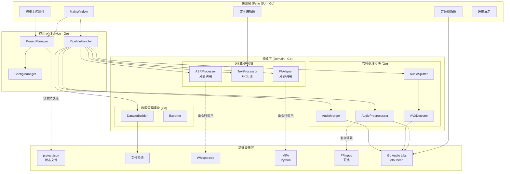
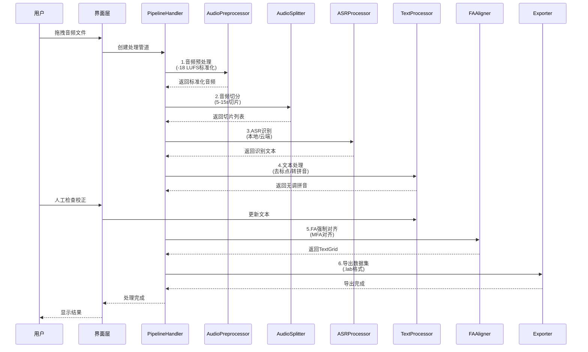
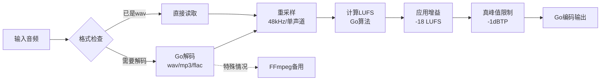
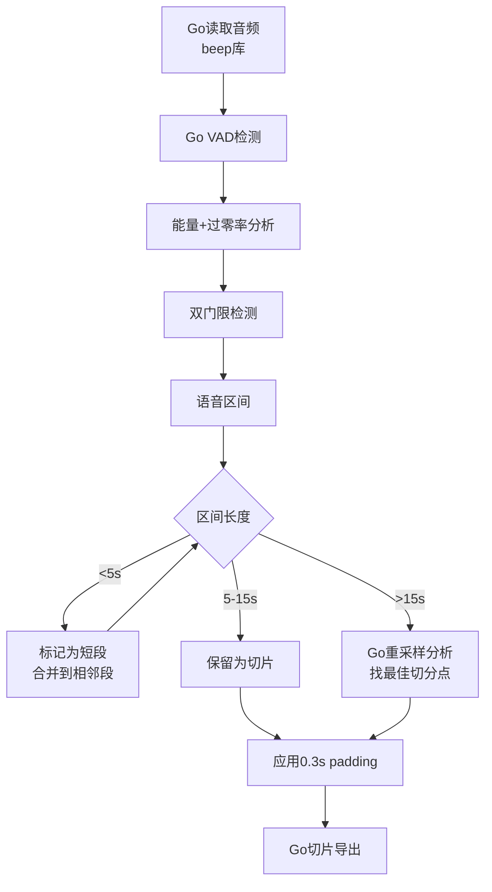
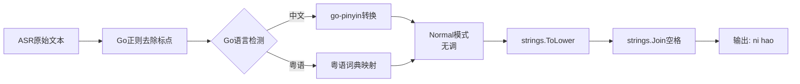

# DataForge Lite - 架构设计文档

> **文档状态**: 草稿
> **版本**: v1.1 (Go原生优先版)
> **最后更新**: 2026-03-09
> **作者**: AI Assistant
> **设计原则**: 最大化使用Go实现，最小化外部依赖

---

## 1. 架构概述

### 1.1 架构目标

| 目标 | 描述 |
|------|------|
| **Go原生优先** | 核心功能尽可能使用Go实现，减少外部语言依赖 |
| **可扩展性** | 支持新的ASR引擎、导出格式通过插件化方式扩展 |
| **高内聚低耦合** | 各处理模块独立，通过标准接口通信 |
| **跨平台** | 支持Windows/macOS/Linux三平台运行 |

### 1.2 技术选型说明

| 功能 | 实现方式 | 说明 |
|------|----------|------|
| **音频处理** | Go原生库 | 使用oto, beep, go-audio等库 |
| **VAD切分** | Go实现 | 基于能量阈值/过零率的Go原生VAD |
| **响度标准化** | Go + FFmpeg | 优先Go实现，复杂场景调FFmpeg |
| **ASR识别** | 外部调用 | Whisper.cpp (C++编译成可执行文件) |
| **拼音转换** | Go库 | github.com/mozillazg/go-pinyin |
| **FA对齐** | 外部调用 | MFA为Python工具，必须调用 |
| **GUI** | Fyne (Go) | 纯Go跨平台GUI框架 |
| **数据库** | SQLite (Go) | mattn/go-sqlite3 |

### 1.3 架构原则

1. **Go优先原则**: 能用Go实现的功能，不用其他语言
2. **单一职责原则**: 每个模块只负责一项明确的任务
3. **管道-过滤器模式**: 音频处理流程采用管道式设计
4. **状态持久化**: 处理状态实时保存，支持断点续传

---

## 2. 系统架构

### 2.1 整体架构图 (C4模型 - 组件级)



### 2.2 核心数据流



---

## 3. 模块设计

### 3.1 模块职责划分

| 模块 | 职责 | 实现方式 | 关键技术 |
|------|------|----------|----------|
| **AudioPreprocessor** | 音频响度标准化、格式转换 | **Go优先** | Go audio + FFmpeg备选 |
| **AudioSplitter** | VAD切分、边界检测、切片管理 | **Go原生** | beep, go-audio |
| **ASRProcessor** | 语音识别、结果缓存 | **外部调用** | whisper.cpp (C++可执行文件) |
| **TextProcessor** | 去标点、拼音转换、文本规范化 | **Go原生** | go-pinyin |
| **FAAligner** | 强制对齐、TextGrid生成 | **外部调用** | MFA (Python) |
| **AudioMerger** | 音频合并、时间戳同步 | **Go原生** | beep |
| **DatasetBuilder** | 数据集构建、元数据管理 | **Go原生** | - |
| **Exporter** | 多格式导出、文件组织 | **Go原生** | encoding/json, os |
| **StateManager** | 状态管理、进度保存 | **Go原生** | JSON文件 |

**状态管理说明**: 不使用数据库，状态通过JSON文件存储在输出目录中

### 3.1.1 Go原生实现模块详解

#### 音频处理 (Go原生)

```go
// 使用 beep 库进行音频处理
import "github.com/gopxl/beep"

// AudioPreprocessor Go原生音频预处理
type AudioPreprocessor struct {
    targetLUFS float64
}

// NormalizeLUFS 使用Go实现响度标准化
func (ap *AudioPreprocessor) NormalizeLUFS(input, output string) error {
    // 1. 读取音频
    streamer, format, err := ap.decode(input)
    if err != nil {
        return err
    }
    
    // 2. 计算当前响度 (Go实现算法)
    currentLUFS := ap.calculateLUFS(streamer)
    
    // 3. 计算增益
    gain := ap.targetLUFS - currentLUFS
    
    // 4. 应用增益并输出
    return ap.applyGainAndSave(streamer, format, gain, output)
}
```

#### VAD切分 (Go原生)

```go
// EnergyBasedVAD 基于能量的VAD实现
type EnergyBasedVAD struct {
    threshold    float64  // 能量阈值
    minSilence   int      // 最小静音帧数
    minSpeech    int      // 最小语音帧数
}

func (v *EnergyBasedVAD) Detect(audio []float64, sampleRate int) []Segment {
    // Go实现的VAD算法
    // 1. 分帧
    // 2. 计算每帧能量
    // 3. 双门限检测
    // 4. 返回语音段
}
```

#### 拼音转换 (Go原生)

```go
import "github.com/mozillazg/go-pinyin"

// PinyinConverter Go拼音转换器
type PinyinConverter struct {
    pinyinArgs pinyin.Args
}

func NewPinyinConverter() *PinyinConverter {
    args := pinyin.NewArgs()
    args.Style = pinyin.Normal  // 无调格式
    return &PinyinConverter{pinyinArgs: args}
}

func (pc *PinyinConverter) Convert(text string) string {
    py := pinyin.Pinyin(text, pc.pinyinArgs)
    // 合并为 "ni hao" 格式
    return strings.Join(py, " ")
}
```

### 3.2 核心接口设计

#### 3.2.1 音频处理器接口

```go
// AudioProcessor 音频处理统一接口
type AudioProcessor interface {
    Process(input string, output string, config Config) error
    GetName() string
    GetProgress() float64
}

// PreprocessorConfig 预处理配置
type PreprocessorConfig struct {
    TargetLUFS     float64  // 目标响度，默认-18
    TruePeakLimit  float64  // 真峰值限制，默认-1.0
    SampleRate     int      // 输出采样率，默认48000
    Channels       int      // 声道数，默认1（单声道）
}

// SplitterConfig 切分配置
type SplitterConfig struct {
    MinDuration    float64  // 最小切片时长，默认5.0s
    MaxDuration    float64  // 最大切片时长，默认15.0s
    VADAggr        int      // VAD激进程度，默认2
    Padding        float64  // 前后保留静音，默认0.3s
}
```

#### 3.2.2 ASR处理器接口

```go
// ASREngine ASR引擎接口
type ASREngine interface {
    Recognize(audioPath string, language string) (string, error)
    GetEngineName() string
    IsAvailable() bool
}

// ASRConfig ASR配置
type ASRConfig struct {
    Mode           string   // "local" 或 "cloud"
    LocalModel     string   // "base", "small", "medium", "large"
    CloudProvider  string   // "aliyun", "xunfei", "baidu"
    APIKey         string
    SecretKey      string
    Language       string   // "zh", "yue"
}
```

#### 3.2.3 文本处理器接口

```go
// TextProcessor 文本处理接口
type TextProcessor interface {
    Process(text string, options TextOptions) (string, error)
    ToPinyin(text string, tone bool) (string, error)  // tone=false表示无调
    RemovePunctuation(text string) string
}

type TextOptions struct {
    RemovePunct    bool     // 是否去除标点
    ToPinyin       bool     // 是否转拼音
    WithTone       bool     // 是否带声调（默认false）
    Language       string   // "zh", "yue"
}
```

#### 3.2.4 FA对齐器接口

```go
// Aligner 强制对齐接口
type Aligner interface {
    Align(audioDir string, textDir string, outputDir string) error
    GenerateTextGrid(audioPath string, text string) (string, error)
    ValidateDictionary(text string) error
}

// MFAConfig MFA配置
type MFAConfig struct {
    AcousticModel  string   // 声学模型路径
    Dictionary     string   // 发音词典路径
    Language       string   // "mandarin", "cantonese"
}
```

---

## 4. 数据架构

### 4.1 核心数据结构

#### 4.1.1 项目结构

```go
// Project 项目根结构
type Project struct {
    ID              string
    Name            string
    CreatedAt       time.Time
    UpdatedAt       time.Time
    Status          ProjectStatus  // pending, processing, completed, error
    
    // 配置
    PreprocessCfg   PreprocessorConfig
    SplitterCfg     SplitterConfig
    ASRCfg          ASRConfig
    
    // 数据
    AudioFiles      []AudioFile
    Slices          []AudioSlice
    
    // 路径
    WorkDir         string
    OutputDir       string
}

// AudioFile 原始音频文件
type AudioFile struct {
    ID              string
    ProjectID       string
    OriginalPath    string
    ProcessedPath   string   // 预处理后路径
    Duration        float64
    SampleRate      int
    Channels        int
    Status          FileStatus
}

// AudioSlice 音频切片
type AudioSlice struct {
    ID              string
    AudioFileID     string
    Index           int
    StartTime       float64
    EndTime         float64
    Duration        float64
    SlicePath       string
    
    // ASR结果
    RawText         string   // 原始识别文本
    ProcessedText   string   // 处理后文本（拼音）
    Language        string   // 检测到的语言
    
    // 人工校正
    IsChecked       bool
    IsCorrected     bool
    CorrectedText   string
    IsValid         bool     // 是否有效（可用于训练）
    
    // FA结果
    TextGridPath    string
    AlignmentScore  float64
}
```

### 4.2 状态存储设计 (JSON文件)

不使用数据库，所有状态通过JSON文件存储在输出目录中。

#### 4.2.1 project.json 结构

```json
{
    "project_id": "uuid-string",
    "name": "项目名称",
    "created_at": "2026-03-09T12:00:00Z",
    "updated_at": "2026-03-09T12:30:00Z",
    "status": "processing",
    "output_dir": "/path/to/output",
    "config": {
        "preprocess": {
            "target_lufs": -18.0
        },
        "split": {
            "min_duration": 5.0,
            "max_duration": 15.0
        },
        "asr": {
            "mode": "local",
            "model": "small"
        }
    },
    "audio_files": [
        {
            "id": "file-001",
            "original_path": "/path/to/input.wav",
            "processed_path": "/path/to/output/processed/input.wav",
            "duration": 120.5,
            "sample_rate": 48000,
            "channels": 1,
            "status": "completed",
            "slices": [
                {
                    "id": "slice-001",
                    "index": 0,
                    "start_time": 0.0,
                    "end_time": 8.5,
                    "duration": 8.5,
                    "slice_path": "/path/to/output/slices/slice_001.wav",
                    "raw_text": "你好世界",
                    "processed_text": "ni hao shi jie",
                    "language": "zh",
                    "is_checked": true,
                    "is_corrected": false,
                    "corrected_text": "",
                    "is_valid": true,
                    "text_grid_path": "/path/to/output/textgrids/slice_001.TextGrid",
                    "alignment_score": 0.95
                }
            ]
        }
    ],
    "processing_log": [
        {
            "stage": "preprocess",
            "status": "completed",
            "message": "预处理完成",
            "timestamp": "2026-03-09T12:05:00Z"
        },
        {
            "stage": "split",
            "status": "completed",
            "message": "切分完成，共15个切片",
            "timestamp": "2026-03-09T12:10:00Z"
        }
    ]
}
```

### 4.3 文件系统结构

```
output_dir/                     # 用户选择的输出目录
├── project.json                # 项目状态文件（替代数据库）
├── config.json                 # 处理配置
├── raw/                        # 原始音频（复制或引用）
│   └── *.wav, *.mp3, etc.
├── processed/                  # 预处理后音频（-18 LUFS）
│   └── *.wav
├── slices/                     # 音频切片（5-15s）
│   ├── slice_001.wav
│   ├── slice_002.wav
│   └── ...
├── transcriptions/             # ASR识别文本
│   ├── slice_001.txt
│   └── ...
├── textgrids/                  # FA对齐结果
│   ├── slice_001.TextGrid
│   └── ...
├── merged/                     # 合并后音频和标注（用于外部精标）
│   ├── merged.wav
│   └── merged.TextGrid
└── final/                      # 最终数据集输出
    ├── audio_001.wav
    ├── audio_001.lab
    └── metadata.json
```

---

## 5. 关键算法设计

### 5.1 音频预处理流程 (Go优先)



**Go实现音频处理核心代码**:

```go
// LUFS计算器 (Go实现)
type LUFSCalculator struct{}

func (lc *LUFSCalculator) Calculate(samples []float64) float64 {
    // ITU-R BS.1770-4 响度标准实现
    // 1. K加权滤波
    filtered := lc.kWeighting(samples)
    // 2. 计算均值
    sum := 0.0
    for _, s := range filtered {
        sum += s * s
    }
    // 3. 返回LUFS值
    return -0.691 + 10*math.Log10(sum/float64(len(filtered)))
}

func (lc *LUFSCalculator) kWeighting(samples []float64) []float64 {
    // K加权滤波器实现
    // ...
}
```

### 5.2 音频切分算法 (Go原生VAD)



**Go VAD实现核心**:

```go
// VADDetector Go语音活动检测
type VADDetector struct {
    energyThreshold    float64  // 能量阈值
    zcrThreshold       float64  // 过零率阈值
    minSpeechFrames    int      // 最小语音帧
    minSilenceFrames   int      // 最小静音帧
}

func (v *VADDetector) Detect(stream beep.StreamSeeker) []Segment {
    // 1. 读取音频缓冲区
    buf := make([][2]float64, 1024)
    
    // 2. 分帧处理
    var segments []Segment
    isSpeech := false
    speechStart := 0
    
    for {
        n, ok := stream.Stream(buf)
        if !ok {
            break
        }
        
        // 3. 计算帧能量和过零率
        energy := v.calculateEnergy(buf[:n])
        zcr := v.calculateZCR(buf[:n])
        
        // 4. 双门限判断
        if energy > v.energyThreshold && zcr < v.zcrThreshold {
            if !isSpeech {
                speechStart = v.currentPos
                isSpeech = true
            }
        } else {
            if isSpeech {
                segments = append(segments, Segment{
                    Start: speechStart,
                    End:   v.currentPos,
                })
                isSpeech = false
            }
        }
    }
    
    return segments
}
```

### 5.3 文本处理流程 (Go原生)



**Go实现代码**:

```go
package text

import (
    "regexp"
    "strings"
    "github.com/mozillazg/go-pinyin"
)

type Processor struct {
    pyArgs pinyin.Args
    punctRegex *regexp.Regexp
}

func NewProcessor() *Processor {
    args := pinyin.NewArgs()
    args.Style = pinyin.Normal  // 无调格式
    
    return &Processor{
        pyArgs: args,
        punctRegex: regexp.MustCompile(`[[:punct:]]`),
    }
}

// RemovePunctuation 去除标点
func (p *Processor) RemovePunctuation(text string) string {
    return p.punctRegex.ReplaceAllString(text, "")
}

// ToPinyin 转换为无调拼音
func (p *Processor) ToPinyin(text string) string {
    // 1. 转拼音切片
    py := pinyin.Pinyin(text, p.pyArgs)
    
    // 2. 扁平化
    var result []string
    for _, words := range py {
        for _, word := range words {
            result = append(result, word)
        }
    }
    
    // 3. 小写+空格连接
    return strings.ToLower(strings.Join(result, " "))
}

// Process 完整处理流程
func (p *Processor) Process(text string) string {
    text = p.RemovePunctuation(text)
    text = p.ToPinyin(text)
    return strings.TrimSpace(text)
}
```

---

## 6. 外部依赖集成（最小化原则）

### 6.1 外部依赖使用策略

| 依赖 | 必要性 | 集成方式 | 说明 |
|------|--------|----------|------|
| **FFmpeg** | 可选 | 命令行调用 | Go复杂音频操作时备用 |
| **Whisper** | 必须 | 命令行调用 | C++编译的可执行文件 |
| **MFA** | 必须 | 命令行调用 | Python工具，无法避免 |

### 6.2 Go音频库选型

```go
// go.mod 依赖
require (
    // GUI
    fyne.io/fyne/v2 v2.4.5
    
    // 音频处理 (Go原生)
    github.com/gopxl/beep v1.4.0
    github.com/go-audio/audio v1.0.0
    github.com/go-audio/wav v1.1.0
    github.com/go-audio/mp3 v1.1.0
    
    // 拼音转换 (Go原生)
    github.com/mozillazg/go-pinyin v0.20.0
    
    
    // 其他工具
    github.com/google/uuid v1.6.0
    github.com/sirupsen/logrus v1.9.0
)
```

### 6.3 FFmpeg 集成（备用方案）

```go
// FFmpegWrapper FFmpeg命令封装
// 仅在Go实现无法满足时使用
type FFmpegWrapper struct {
    Executable string
}

// 保留用于复杂场景
func (f *FFmpegWrapper) ComplexOperation(input, output string) error {
    cmd := exec.Command(f.Executable,
        "-i", input,
        // 复杂滤镜链等Go难以实现的场景
        "-y", output,
    )
    return cmd.Run()
}
```

### 6.4 Whisper 集成

```go
// WhisperEngine 调用whisper.cpp编译的可执行文件
type WhisperEngine struct {
    Executable string  // whisper.cpp编译后的可执行文件
    ModelPath  string
}

func (w *WhisperEngine) Recognize(audioPath string, language string) (string, error) {
    // 调用 whisper.cpp 主程序
    cmd := exec.Command(w.Executable,
        "-m", w.ModelPath,
        "-f", audioPath,
        "-l", language,
        "--output-txt",
    )
    
    output, err := cmd.Output()
    if err != nil {
        return "", err
    }
    
    return string(output), nil
}
```

### 6.5 MFA 集成

```go
// MFAEngine MFA对齐引擎（Python工具，必须外部调用）
type MFAEngine struct {
    MFAPath    string
    ModelPath  string
    DictPath   string
}

func (m *MFAEngine) Align(corpusDir, outputDir string) error {
    cmd := exec.Command(m.MFAPath, "align",
        corpusDir,
        m.DictPath,
        m.ModelPath,
        outputDir,
        "--clean",
        "--verbose",
    )
    return cmd.Run()
}
```

### 6.6 完全Go实现的模块

```go
// AudioProcessor 纯Go音频预处理
type AudioProcessor struct {
    targetLUFS float64
}

func (ap *AudioProcessor) Process(input, output string) error {
    // 1. Go解码
    f, err := os.Open(input)
    if err != nil {
        return err
    }
    defer f.Close()
    
    // 2. 使用 go-audio 解码
    decoder := wav.NewDecoder(f)
    buf, err := decoder.FullPCMBuffer()
    if err != nil {
        return err
    }
    
    // 3. Go实现响度标准化
    normalized := ap.normalize(buf)
    
    // 4. Go编码输出
    out, err := os.Create(output)
    if err != nil {
        return err
    }
    defer out.Close()
    
    encoder := wav.NewEncoder(out,
        buf.Format.SampleRate,
        buf.SourceBitDepth,
        buf.Format.NumChannels,
        1)
    
    return encoder.Write(normalized)
}
```

---

## 7. 配置设计

### 7.1 全局配置 (config.json)

```json
{
    "audio": {
        "go_native_first": true,
        "ffmpeg": {
            "executable": "ffmpeg",
            "ffprobe": "ffprobe",
            "use_as_fallback": true
        }
    },
    "whisper": {
        "executable": "./assets/whisper/whisper-cli",
        "models_dir": "./assets/models/whisper",
        "default_model": "small"
    },
    "mfa": {
        "executable": "mfa",
        "models_dir": "./assets/models/mfa",
        "dictionaries_dir": "./assets/dictionaries"
    },
    "asr": {
        "default_mode": "local",
        "cloud_providers": {
            "aliyun": {
                "app_key": "",
                "access_key": "",
                "secret_key": ""
            }
        }
    },
    "processing": {
        "go_native": true,
        "default_lufs": -18.0,
        "default_min_slice": 5.0,
        "default_max_slice": 15.0,
        "default_vad_aggr": 2
    },
    "go_libs": {
        "audio_decoder": "github.com/go-audio/wav",
        "audio_player": "github.com/gopxl/beep",
        "pinyin": "github.com/mozillazg/go-pinyin",
        "state_storage": "JSON文件"
    }
}
```

### 7.2 项目级配置

每个项目独立保存配置，覆盖全局默认值。

---

## 8. 错误处理设计

### 8.1 错误分类

| 错误级别 | 类型 | 处理方式 |
|----------|------|----------|
| **Fatal** | 系统错误、依赖缺失 | 终止处理，提示用户修复 |
| **Error** | 处理失败、格式错误 | 记录错误，跳过当前文件，继续处理其他 |
| **Warning** | 质量问题、识别置信度低 | 标记警告，人工检查 |
| **Info** | 正常信息提示 | 日志记录 |

### 8.2 重试机制

```go
// 云端ASR重试
const (
    MaxRetries = 3
    RetryDelay = 2 * time.Second
)

func (c *CloudASR) RecognizeWithRetry(audioPath string) (string, error) {
    var lastErr error
    for i := 0; i < MaxRetries; i++ {
        result, err := c.Recognize(audioPath)
        if err == nil {
            return result, nil
        }
        lastErr = err
        time.Sleep(RetryDelay * time.Duration(i+1))
    }
    return "", fmt.Errorf("ASR failed after %d retries: %w", MaxRetries, lastErr)
}
```

---

## 9. 扩展点设计

### 9.1 新增ASR引擎

```go
// 实现ASREngine接口
type NewASREngine struct {
    // 配置
}

func (n *NewASREngine) Recognize(audioPath string, language string) (string, error) {
    // 实现识别逻辑
}

func (n *NewASREngine) GetEngineName() string {
    return "new_engine"
}

// 注册到引擎工厂
func init() {
    RegisterASREngine("new_engine", func() ASREngine {
        return &NewASREngine{}
    })
}
```

### 9.2 新增导出格式

```go
type NewFormatExporter struct{}

func (n *NewFormatExporter) Export(slices []AudioSlice, outputDir string) error {
    // 实现导出逻辑
}

func (n *NewFormatExporter) GetFormat() string {
    return "new_format"
}
```

---

**文档结束**
