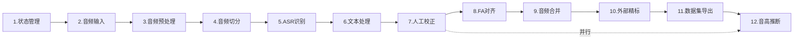

# DataForge Lite - 开发任务规划

> **文档状态**: 草稿  
> **版本**: v1.1 (无数据库版)  
> **最后更新**: 2026-03-09  
> **作者**: AI Assistant  
> **说明**: 轻量级数据集制作工具，状态通过JSON文件存储

---

## 任务执行顺序



---

- [ ] 1. 实现【状态管理和配置】功能子需求
  - 创建项目数据模型结构体（Project, AudioFile, AudioSlice）
  - 实现project.json读写接口（状态持久化）
  - 实现全局配置管理（config.json读写）
  - 创建输出目录结构初始化逻辑
  - 实现处理进度保存和恢复机制
  - 确保子需求可独立运行
  - _需求：[PM-1, PM-2, PM-3, PM-4]_
  - _测试：[JSON读写测试，目录创建测试，状态恢复测试]_

- [ ] 2. 实现【音频输入管理】功能子需求
  - 实现拖拽上传组件（Fyne实现）
  - 实现多文件批量导入接口
  - 实现音频文件元信息读取（时长、采样率、声道）
  - 实现文件列表展示和管理（删除、排序）
  - 实现音频格式验证（WAV, MP3, FLAC, M4A, OGG）
  - 实现导入文件记录到project.json
  - 确保子需求可独立运行
  - _需求：[M001-1, M001-2, M001-3, M001-4, M001-5]_
  - _测试：[拖拽上传接口，音频元信息读取接口，格式验证接口]_

- [ ] 3. 实现【音频预处理】功能子需求
  - 集成go-audio库实现音频解码（WAV/MP3/FLAC）
  - 实现LUFS响度计算算法（ITU-R BS.1770-4标准）
  - 实现响度标准化到-18 LUFS的增益计算和应用
  - 实现音频重采样到48kHz单声道
  - 实现真峰值限制（-1 dBTP）
  - 实现预处理进度回调并保存到project.json
  - 确保子需求可独立运行
  - _需求：[M002-1, M002-2, M002-3, M002-4]_
  - _测试：[响度计算精度测试，标准化后音频验证，重采样质量测试]_

- [ ] 4. 实现【音频智能切分】功能子需求
  - 实现基于能量和过零率的VAD检测器（Go原生）
  - 实现音频分帧和语音区间检测算法
  - 实现5-15秒切片边界计算逻辑
  - 实现切分参数配置（最小/最大时长）
  - 实现切片导出和路径管理
  - 实现切片信息记录到project.json
  - 确保子需求可独立运行
  - _需求：[M003-1, M003-2, M003-3, M003-4, M003-5, M003-6]_
  - _测试：[VAD准确性测试，切片时长范围验证，边界检测测试]_

- [ ] 5. 实现【ASR语音识别】功能子需求
  - 集成whisper.cpp可执行文件调用
  - 实现本地Whisper模型识别接口
  - 实现云端ASR API调用（阿里云/讯飞/百度）
  - 实现本地/云端双模式切换配置
  - 实现ASR识别结果缓存到project.json
  - 实现识别进度回调接口
  - 确保子需求可独立运行
  - _需求：[M004-1, M004-2, M004-3, M004-4, M004-5, M004-6, M004-7]_
  - _测试：[本地Whisper调用接口，云端API调用接口，缓存机制验证]_

- [ ] 6. 实现【文本后处理】功能子需求
  - 集成go-pinyin库实现拼音转换
  - 实现无调拼音转换（Normal模式）
  - 实现标点符号去除（正则表达式）
  - 实现中文/粤语语言自动检测
  - 实现粤语拼音转换（粤语词典映射）
  - 实现文本规范化处理（全小写、空格分词）
  - 确保子需求可独立运行
  - _需求：[M005-1, M005-2, M005-3, M005-4, M005-5]_
  - _测试：[拼音转换精度测试，标点去除测试，语言检测准确性]_

- [ ] 7. 实现【人工检查校正】功能子需求
  - 实现切片列表展示界面（表格形式，从project.json读取）
  - 实现文本编辑框和实时保存到project.json
  - 实现音频切片播放控制
  - 实现快捷键支持（播放/暂停/下一条）
  - 实现问题切片标记功能
  - 实现批量操作（删除、跳过）接口
  - 实现校正进度自动持久化
  - 确保子需求可独立运行
  - _需求：[M006-1, M006-2, M006-3, M006-4, M006-5, M006-6, M006-7]_
  - _测试：[列表加载接口，文本保存接口，播放控制接口]_

- [ ] 8. 实现【FA强制对齐】功能子需求
  - 集成MFA命令行调用
  - 实现MFA声学模型和词典配置
  - 实现TextGrid格式解析和生成
  - 实现对齐进度监控接口并更新project.json
  - 实现对齐失败处理逻辑
  - 实现音素级别对齐结果路径记录
  - 确保子需求可独立运行
  - _需求：[M007-1, M007-2, M007-3, M007-4, M007-5, M007-6]_
  - _测试：[MFA调用接口，TextGrid解析测试，对齐精度验证]_

- [ ] 9. 实现【音频合并】功能子需求
  - 实现切片按顺序合并逻辑（beep库）
  - 实现TextGrid标注时间戳同步调整
  - 实现合并后音频导出
  - 实现合并进度回调接口
  - 实现合并信息记录到project.json
  - 确保子需求可独立运行
  - _需求：[M008-1, M008-2, M008-3, M008-4, M008-5]_
  - _测试：[合并音频质量测试，时间戳同步验证，播放功能测试]_

- [ ] 10. 实现【外部精标注工作流】功能子需求
  - 实现Praat兼容的TextGrid导出
  - 实现外部标注文件导入接口
  - 实现TextGrid修改检测和同步到project.json
  - 实现标注状态管理和版本记录
  - 确保子需求可独立运行
  - _需求：[M009-1, M009-2, M009-3, M009-4]_
  - _测试：[TextGrid导出格式验证，导入同步测试，修改检测测试]_

- [ ] 11. 实现【数据集导出】功能子需求
  - 实现.lab格式文件生成（与音频同名）
  - 实现音频和标注文件拆分导出
  - 实现metadata.json元信息文件生成
  - 实现VITS/Bert-VITS2格式支持
  - 实现导出目录结构组织
  - 实现导出进度回调接口
  - 确保子需求可独立运行
  - _需求：[M010-1, M010-2, M010-3, M010-4, M010-5]_
  - _测试：[.lab文件格式验证，导出文件完整性测试，元信息正确性]_

- [ ] 12. 实现【音高推断与标注】功能子需求
  - 实现F0基频提取算法（Go原生）
  - 实现音高轮廓数据计算
  - 实现音高数据可视化界面
  - 实现异常音高值检测逻辑
  - 实现音高数据导出接口
  - 实现音高信息记录到project.json
  - 确保子需求可独立运行
  - _需求：[M011-1, M011-2, M011-3, M011-4, M011-5]_
  - _测试：[F0提取精度测试，可视化渲染测试，异常检测测试]_

- [ ] 13. 实现【处理管道编排】功能子需求
  - 实现管道处理器（PipelineHandler）
  - 实现各阶段状态管理和project.json更新
  - 实现处理进度统一回调接口
  - 实现错误处理和重试机制
  - 实现断点续传逻辑（从project.json恢复）
  - 集成所有处理模块到完整工作流
  - 确保子需求可独立运行
  - _需求：[整体流程]_
  - _测试：[管道状态流转测试，断点续传测试，错误恢复测试]_

---

## 任务依赖关系

```
任务1 (状态管理)
    ↓
任务2 (音频输入)
    ↓
任务3 (预处理) → 依赖: 任务2
    ↓
任务4 (切分) → 依赖: 任务3
    ↓
任务5 (ASR) → 依赖: 任务4
    ↓
任务6 (文本处理) → 依赖: 任务5
    ↓
任务7 (人工校正) → 依赖: 任务6
    ↓
任务8 (FA对齐) → 依赖: 任务7
    ↓
任务9 (音频合并) → 依赖: 任务8
    ↓
任务10 (外部精标) → 依赖: 任务9
    ↓
任务11 (导出) → 依赖: 任务7或任务10
    
任务12 (音高推断) → 依赖: 任务4（可与7并行）

任务13 (管道编排) → 依赖: 任务1-12全部完成
```

---

## 状态存储说明

不使用SQLite数据库，所有状态通过 **project.json** 文件存储在用户指定的输出目录中。

### project.json 结构

```json
{
    "project_id": "uuid",
    "name": "项目名称",
    "created_at": "2026-03-09T12:00:00Z",
    "updated_at": "2026-03-09T12:30:00Z",
    "status": "processing",
    "output_dir": "/path/to/output",
    "config": { ... },
    "audio_files": [ ... ],
    "processing_log": [ ... ]
}
```

### 目录结构

```
output_dir/
├── project.json          # 项目状态文件（核心）
├── config.json           # 处理配置
├── processed/            # 预处理后音频
├── slices/               # 音频切片
├── textgrids/            # FA对齐结果
├── merged/               # 合并后文件
└── final/                # 最终数据集
```

---

## 技术栈汇总

| 类别 | 技术选型 |
|------|----------|
| 语言 | Go 1.21+ |
| GUI | Fyne v2 |
| 音频处理 | beep, go-audio/wav, go-audio/mp3 |
| 拼音转换 | mozillazg/go-pinyin |
| 状态存储 | JSON文件（标准库encoding/json） |
| 日志 | sirupsen/logrus |
| ASR | whisper.cpp (外部调用) |
| FA对齐 | MFA (外部调用) |

---

**文档结束**
