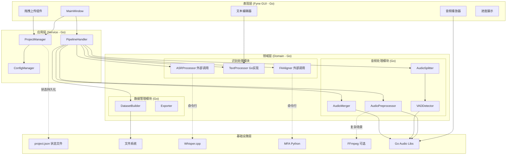
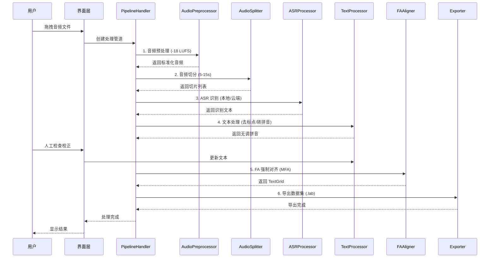

# DataForge Lite - 架构设计文档

> **文档状态**: 草稿  
> **版本**: v2.0（Go 原生优先 / 无数据库版）  
> **最后更新**: 2026-03-11  
> **作者**: AI Assistant  
> **设计原则**: 最大化 Go 实现，最小化外部依赖；状态仅用 JSON 文件存储

---

## 目录

- [1. 架构概述](#1-架构概述)
- [2. 系统架构](#2-系统架构)
- [3. 模块设计](#3-模块设计)
- [4. 数据架构](#4-数据架构)
- [5. 关键算法设计](#5-关键算法设计)
- [6. 外部依赖集成](#6-外部依赖集成最小化原则)
- [7. 配置设计](#7-配置设计)
- [8. 错误处理设计](#8-错误处理设计)
- [9. 扩展点设计](#9-扩展点设计)

---

## 1. 架构概述

### 1.1 架构目标

| 目标 | 描述 |
|------|------|
| **Go 原生优先** | 核心功能尽量用 Go 实现，减少外部语言依赖 |
| **可扩展性** | 通过插件化支持新 ASR 引擎、新导出格式 |
| **高内聚低耦合** | 各处理模块独立，通过标准接口通信 |
| **跨平台** | Windows / macOS / Linux |

### 1.2 技术选型说明

| 功能 | 实现方式 | 说明 |
|------|----------|------|
| **音频处理** | Go 原生库 | oto, beep, go-audio |
| **VAD 切分** | Go 实现 | 能量阈值 / 过零率 VAD |
| **响度标准化** | Go + FFmpeg 可选 | 优先 Go，复杂场景用 FFmpeg |
| **ASR** | 外部调用 | whisper.cpp 可执行文件 |
| **拼音转换** | Go 库 | github.com/mozillazg/go-pinyin |
| **FA 对齐** | 外部调用 | MFA（Python 工具） |
| **GUI** | Fyne (Go) | 跨平台 GUI |
| **状态存储** | **JSON 文件** | project.json / config.json，**无数据库** |

### 1.3 架构原则

1. **Go 优先**：能用 Go 实现的不用其他语言。  
2. **单一职责**：每个模块只负责一项明确任务。  
3. **管道-过滤器**：音频处理采用管道式设计。  
4. **状态持久化**：处理状态实时写入 JSON，支持断点续传。

---

## 2. 系统架构

### 2.1 整体架构图（C4 组件级）



### 2.2 核心数据流



---

## 3. 模块设计

### 3.1 模块职责划分

| 模块 | 职责 | 实现方式 | 关键技术 |
|------|------|----------|----------|
| **AudioPreprocessor** | 响度标准化、格式转换 | Go 优先 | Go audio + FFmpeg 备选 |
| **AudioSplitter** | VAD 切分、边界检测、切片管理 | Go 原生 | beep, go-audio |
| **ASRProcessor** | 语音识别、结果缓存 | 外部调用 | whisper.cpp |
| **TextProcessor** | 去标点、拼音、文本规范化 | Go 原生 | go-pinyin |
| **FAAligner** | 强制对齐、TextGrid 生成 | 外部调用 | MFA |
| **AudioMerger** | 音频合并、时间戳同步 | Go 原生 | beep |
| **DatasetBuilder** | 数据集构建、元数据 | Go 原生 | - |
| **Exporter** | 多格式导出、文件组织 | Go 原生 | encoding/json, os |
| **StateManager** | 状态与进度 | Go 原生 | **JSON 文件，无数据库** |

### 3.1.1 Go 原生实现要点

#### 音频预处理（Go）

- 使用 beep 解码；计算 LUFS（Go 实现算法）；应用增益并输出；真峰值限制。

#### VAD 切分（Go）

- EnergyBasedVAD：能量阈值、最小静音/语音帧数；分帧 → 能量/过零率 → 双门限 → 语音段。

#### 拼音转换（Go）

- go-pinyin，Style=Normal（无调）；去标点后转拼音，小写 + 空格连接。

### 3.2 核心接口设计

#### 3.2.1 音频处理器

```go
type AudioProcessor interface {
    Process(input, output string, config Config) error
    GetName() string
    GetProgress() float64
}

type PreprocessorConfig struct {
    TargetLUFS    float64  // 默认 -18
    TruePeakLimit float64  // 默认 -1.0
    SampleRate    int      // 默认 48000
    Channels      int      // 默认 1
}

type SplitterConfig struct {
    MinDuration float64  // 默认 5.0
    MaxDuration float64  // 默认 15.0
    VADAggr     int
    Padding     float64  // 默认 0.3
}
```

#### 3.2.2 ASR 处理器

```go
type ASREngine interface {
    Recognize(audioPath string, language string) (string, error)
    GetEngineName() string
    IsAvailable() bool
}

type ASRConfig struct {
    Mode          string  // "local" | "cloud"
    LocalModel    string  // base, small, medium, large
    CloudProvider string
    APIKey        string
    SecretKey     string
    Language      string  // zh, yue
}
```

#### 3.2.3 文本处理器

```go
type TextProcessor interface {
    Process(text string, options TextOptions) (string, error)
    ToPinyin(text string, tone bool) (string, error)
    RemovePunctuation(text string) string
}

type TextOptions struct {
    RemovePunct bool
    ToPinyin    bool
    WithTone    bool
    Language    string
}
```

#### 3.2.4 FA 对齐器

```go
type Aligner interface {
    Align(audioDir, textDir, outputDir string) error
    GenerateTextGrid(audioPath, text string) (string, error)
    ValidateDictionary(text string) error
}

type MFAConfig struct {
    AcousticModel string
    Dictionary    string
    Language      string  // mandarin, cantonese
}
```

---

## 4. 数据架构

### 4.1 核心数据结构（概要）

- **Project**：ID、Name、时间、Status、OutputDir、Config、AudioFiles、WorkDir 等。  
- **AudioFile**：ID、ProjectID、OriginalPath、ProcessedPath、Duration、SampleRate、Channels、Status。  
- **AudioSlice**：ID、AudioFileID、Index、起止时间、Duration、SlicePath、RawText、ProcessedText、Language、IsChecked、CorrectedText、IsValid、TextGridPath、AlignmentScore。

### 4.2 状态存储（仅 JSON，无数据库）

状态全部存于输出目录下的 **project.json**。

- 顶层：project_id、name、created_at、updated_at、status、output_dir、config。  
- audio_files：数组，每项含 slices 等。  
- processing_log：阶段、状态、消息、时间戳。

### 4.3 文件系统结构

```
output_dir/
├── project.json
├── config.json
├── raw/
├── processed/
├── slices/
├── transcriptions/
├── textgrids/
├── merged/
└── final/
```

（与《开发计划》中目录说明一致。）

---

## 5. 关键算法设计

### 5.1 音频预处理流程（Go 优先）

输入 → 格式检查 → Go 解码 / 直接读取 → 重采样 48kHz 单声道 → 计算 LUFS（Go）→ 应用增益 -18 LUFS → 真峰值限制 -1 dBTP → Go 编码输出；复杂场景可退避 FFmpeg。

### 5.2 音频切分（Go VAD）

Go 读取 → VAD（能量+过零率）→ 双门限 → 语音区间 → 按 5–15s 规则切分 / 合并短段 / 长段找切分点 → padding → 切片导出。

### 5.3 文本处理（Go）

ASR 文本 → 正则去标点 → 语言检测 → 中文 go-pinyin / 粤语词典 → Normal 无调 → ToLower + 空格连接 → 输出如 `ni hao`。

---

## 6. 外部依赖集成（最小化原则）

| 依赖 | 必要性 | 集成方式 |
|------|--------|----------|
| FFmpeg | 可选 | 命令行，Go 无法满足时使用 |
| Whisper | 必须 | 调用 whisper.cpp 可执行文件 |
| MFA | 必须 | 命令行调用 Python 工具 |

**Go 依赖**：fyne.io/fyne/v2、gopxl/beep、go-audio/*、mozillazg/go-pinyin、google/uuid、sirupsen/logrus。**不依赖** SQLite，状态仅用 JSON。

---

## 7. 配置设计

- **全局配置 config.json**：audio（go_native_first、ffmpeg 可选）、whisper（可执行文件、模型目录）、mfa（可执行文件、模型与词典目录）、asr（默认模式、云端密钥）、processing（默认 LUFS、切片范围、VAD 等）。  
- **项目级配置**：可覆盖全局默认，随 project.json 保存。

---

## 8. 错误处理设计

- **Fatal**：系统/依赖错误 → 终止并提示。  
- **Error**：处理失败/格式错误 → 记录并跳过当前项，继续其他。  
- **Warning**：质量/置信度问题 → 标记供人工检查。  
- **Info**：正常日志。  
- 云端 ASR 等可加重试（如最多 3 次、指数退避）。

---

## 9. 扩展点设计

- **新 ASR 引擎**：实现 `ASREngine` 接口并注册到工厂。  
- **新导出格式**：实现导出接口（如 Export(slices, outputDir)），返回格式名。

---

**文档结束**
