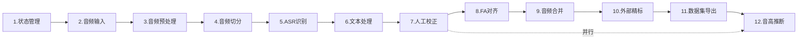

# DataForge Lite - 开发任务规划

> **文档状态**: 草稿  
> **版本**: v2.0（无数据库版）  
> **最后更新**: 2026-03-11  
> **作者**: AI Assistant  
> **说明**: 轻量级数据集制作工具，状态通过 JSON 文件存储（project.json / config.json）

---

## 目录

- [任务执行顺序](#任务执行顺序)
- [任务清单（1–13）](#任务清单113)
- [任务依赖关系](#任务依赖关系)
- [状态存储说明](#状态存储说明)
- [技术栈汇总](#技术栈汇总)

---

## 任务执行顺序



---

## 任务清单（1–13）

- [ ] **1. 状态管理和配置**
  - 定义项目数据模型（Project、AudioFile、AudioSlice）
  - 实现 project.json 读写与状态持久化
  - 实现全局配置 config.json 读写
  - 初始化输出目录结构
  - 实现处理进度保存与恢复
  - 子需求可独立运行
  - _需求：[PM-1, PM-2, PM-3, PM-4]_  
  - _测试：JSON 读写、目录创建、状态恢复_

- [ ] **2. 音频输入管理**
  - 拖拽上传组件（Fyne）
  - 多文件批量导入
  - 音频元信息读取（时长、采样率、声道）
  - 文件列表展示与管理（删除、排序）
  - 格式校验：WAV、MP3、FLAC、M4A、OGG
  - 导入结果写入 project.json
  - _需求：[M001-1 ~ M001-5]_  
  - _测试：拖拽接口、元信息读取、格式校验_

- [ ] **3. 音频预处理**
  - 集成 go-audio 解码（WAV/MP3/FLAC）
  - LUFS 响度计算（ITU-R BS.1770-4）
  - 响度标准化到 -18 LUFS（增益计算与应用）
  - 重采样到 48kHz 单声道
  - 真峰值限制 -1 dBTP
  - 预处理进度回调并写入 project.json
  - _需求：[M002-1 ~ M002-4]_  
  - _测试：响度精度、标准化结果、重采样质量_

- [ ] **4. 音频智能切分**
  - 基于能量与过零率的 VAD（Go 原生）
  - 分帧与语音区间检测
  - 5–15 秒切片边界计算
  - 切分参数配置（最小/最大时长）
  - 切片导出与路径管理
  - 切片信息写入 project.json
  - _需求：[M003-1 ~ M003-6]_  
  - _测试：VAD 准确性、时长范围、边界检测_

- [ ] **5. ASR 语音识别**
  - 集成 whisper.cpp 可执行文件调用
  - 本地 Whisper 识别接口
  - 云端 ASR API（阿里云/讯飞/百度）
  - 本地/云端模式配置与切换
  - 识别结果缓存到 project.json
  - 识别进度回调
  - _需求：[M004-1 ~ M004-7]_  
  - _测试：本地/云端调用、缓存机制_

- [ ] **6. 文本后处理**
  - 集成 go-pinyin，无调拼音（Normal 模式）
  - 标点去除（正则）
  - 中文/粤语语言检测
  - 粤语拼音转换（粤语词典映射）
  - 文本规范化（小写、空格分词）
  - _需求：[M005-1 ~ M005-5]_  
  - _测试：拼音精度、标点去除、语言检测_

- [ ] **7. 人工检查校正**
  - 切片列表展示（表格，从 project.json 读取）
  - 文本编辑与实时保存到 project.json
  - 切片播放控制
  - 快捷键：播放/暂停/下一条
  - 问题切片标记
  - 批量操作：删除、跳过
  - 校正进度持久化
  - _需求：[M006-1 ~ M006-7]_  
  - _测试：列表加载、文本保存、播放控制_

- [ ] **8. FA 强制对齐**
  - 集成 MFA 命令行调用
  - MFA 声学模型与词典配置
  - TextGrid 解析与生成
  - 对齐进度监控并更新 project.json
  - 对齐失败处理与标记
  - 音素级对齐结果路径记录
  - _需求：[M007-1 ~ M007-6]_  
  - _测试：MFA 调用、TextGrid 解析、对齐结果_

- [ ] **9. 音频合并**
  - 切片按序合并（beep）
  - TextGrid 时间戳同步调整
  - 合并后音频导出
  - 合并进度回调
  - 合并信息写入 project.json
  - _需求：[M008-1 ~ M008-5]_  
  - _测试：合并质量、时间戳同步、播放_

- [ ] **10. 外部精标注工作流**
  - Praat 兼容 TextGrid 导出
  - 外部标注文件导入
  - TextGrid 修改检测与同步到 project.json
  - 标注状态与版本记录
  - _需求：[M009-1 ~ M009-4]_  
  - _测试：导出格式、导入同步、修改检测_

- [ ] **11. 数据集导出**
  - 生成与音频同名的 .lab
  - 音频与标注拆分导出
  - metadata.json 生成
  - VITS / Bert-VITS2 格式支持
  - 导出目录组织与进度回调
  - _需求：[M010-1 ~ M010-5]_  
  - _测试：.lab 格式、文件完整性、元信息_

- [ ] **12. 音高推断与标注**
  - F0 基频提取（Go 原生）
  - 音高轮廓计算
  - 音高可视化界面
  - 异常音高检测
  - 音高数据导出与 project.json 记录
  - _需求：[M011-1 ~ M011-5]_  
  - _测试：F0 精度、可视化、异常检测_

- [ ] **13. 处理管道编排**
  - PipelineHandler 管道处理器
  - 各阶段状态与 project.json 更新
  - 统一进度回调与错误处理、重试
  - 断点续传（从 project.json 恢复）
  - 集成上述模块为完整工作流
  - _需求：整体流程_  
  - _测试：状态流转、断点续传、错误恢复_

---

## 任务依赖关系

```
任务1 (状态管理)
    ↓
任务2 (音频输入)
    ↓
任务3 (预处理)     ← 依赖 任务2
    ↓
任务4 (切分)       ← 依赖 任务3
    ↓
任务5 (ASR)        ← 依赖 任务4
    ↓
任务6 (文本处理)   ← 依赖 任务5
    ↓
任务7 (人工校正)   ← 依赖 任务6
    ↓
任务8 (FA对齐)     ← 依赖 任务7
    ↓
任务9 (音频合并)   ← 依赖 任务8
    ↓
任务10 (外部精标)  ← 依赖 任务9
    ↓
任务11 (导出)      ← 依赖 任务7 或 任务10

任务12 (音高推断)  ← 依赖 任务4（可与 任务7 并行）

任务13 (管道编排)  ← 依赖 任务1–12 全部完成
```

---

## 状态存储说明

无数据库，所有状态通过 **project.json** 存于用户指定的输出目录。

### project.json 结构（概要）

```json
{
    "project_id": "uuid",
    "name": "项目名称",
    "created_at": "2026-03-11T12:00:00Z",
    "updated_at": "2026-03-11T12:30:00Z",
    "status": "processing",
    "output_dir": "/path/to/output",
    "config": { ... },
    "audio_files": [ ... ],
    "processing_log": [ ... ]
}
```

### 输出目录结构

```
output_dir/
├── project.json      # 项目状态（核心）
├── config.json       # 处理配置
├── processed/        # 预处理后音频
├── slices/           # 音频切片
├── textgrids/        # FA 对齐结果
├── merged/           # 合并后文件
└── final/            # 最终数据集
```

---

## 技术栈汇总

| 类别 | 技术选型 |
|------|----------|
| 语言 | Go 1.21+ |
| GUI | Fyne v2 |
| 音频处理 | beep, go-audio/wav, go-audio/mp3 |
| 拼音转换 | mozillazg/go-pinyin |
| 状态存储 | JSON（encoding/json），无数据库 |
| 日志 | sirupsen/logrus |
| ASR | whisper.cpp（外部可执行文件） |
| FA 对齐 | MFA（外部调用） |

---

**文档结束**
